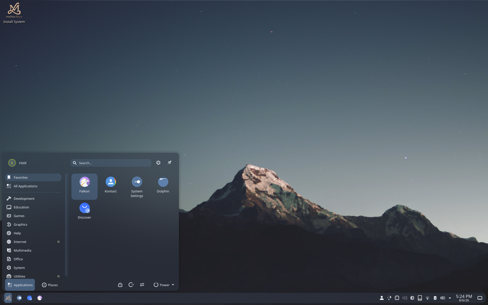
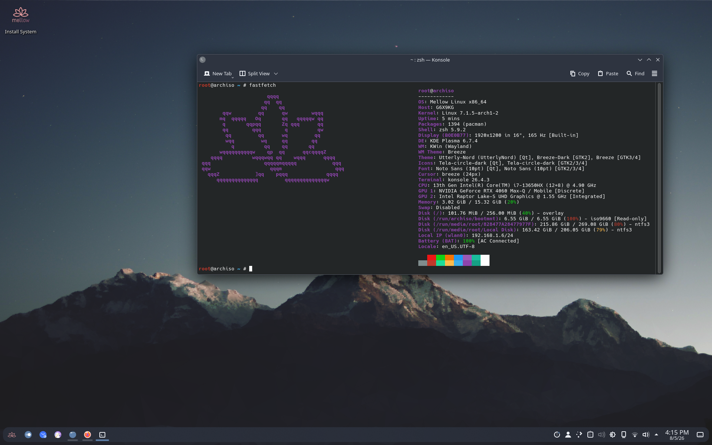
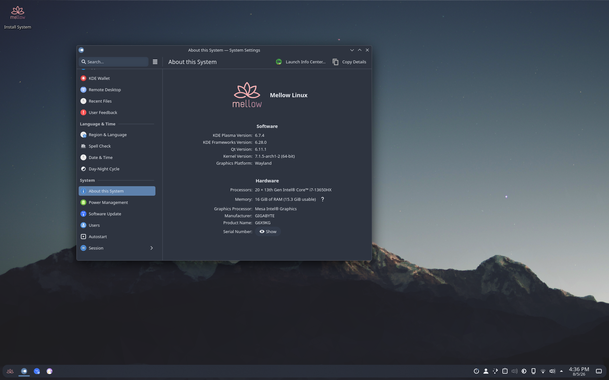

<div align="center">


**A modern, Arch-based Linux distribution focused on simplicity, elegance, and customizability**


</div>

---

## About

Mellow Linux is an Arch-based Linux distribution designed to provide a clean, modern, and enjoyable desktop experience without getting in your way. It combines the flexibility and rolling-release nature of Arch Linux with a polished, user-friendly environment, making it suitable for both newcomers and experienced Linux users.

Designed around the GNOME desktop environment, Mellow emphasizes consistency, simplicity, and responsiveness. Every component is chosen with the intention of creating an operating system that feels modern, uncluttered, and enjoyable for everyday use.

Rather than changing what makes Arch great, Mellow builds upon it by offering sensible defaults, a refined visual style, and a foundation that's easy to personalize. Whether you're using your computer for development, gaming, content creation, or everyday tasks, Mellow aims to stay fast, reliable, and out of your way.


---

> **Mellow Linux is currently in active development. Features, appearance, and documentation are subject to change as the project evolves.**
 









---

## How to Build

Mellow Linux uses `mkarchiso` to build the installation image.

### Requirements

Install the required packages:

```bash
sudo pacman -S archiso git
```

### Clone the Repository

```bash
git clone https://github.com/f1ow3rss/mellow-linux.git
cd mellow-linux
```

### Build the ISO

```bash
sudo mkarchiso -v -w work -o out .
```
Depending on your hardware, the build process may take several minutes.
The finished ISO will be located in the `out/` directory.

### Test the ISO first

Before installing Mellow Linux on physical hardware, it is recommended to test the generated ISO in a virtual machine.

Testing the image first allows you to verify that customizations, installers, themes, and desktop configuration behave as expected before deployment.

---

### Contributing

Contributions of all sizes are welcome.
Whether you are fixing bugs, improving documentation, refining the desktop experience, or suggesting new ideas, your contributions help make Mellow Linux better for everyone.
If you discover a bug or have a feature request, please open an issue describing the problem or suggestion in as much detail as possible.

---

### License
This project is distributed under the MIT License.

You are free to use, modify, distribute, and build upon Mellow Linux in accordance with the terms of the license.