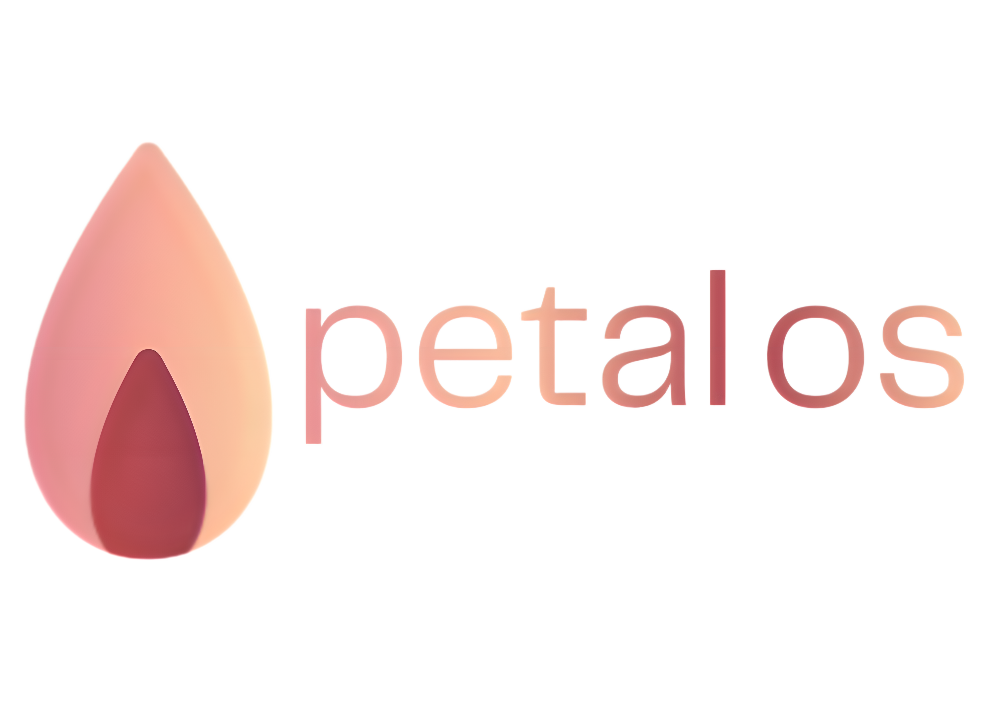

**A modern, Arch-based Linux distribution focused on simplicity, elegance, and freedom.**

---

## About

PetalOS is an Arch-based Linux distribution designed to provide a clean, modern, and enjoyable desktop experience without getting in your way. It combines the flexibility and rolling-release nature of Arch Linux with a polished, user-friendly environment, making it suitable for both newcomers and experienced Linux users.

Rather than changing what makes Arch great, PetalOS builds upon it by offering sensible defaults, a refined visual style, and a foundation that's easy to personalize. Whether you're using your computer for development, gaming, content creation, or everyday tasks, PetalOS aims to stay fast, reliable, and out of your way.

PetalOS is built around the idea that your operating system should adapt to you, not the other way around.

---

> **PetalOS is currently in active development. Features, appearance, and documentation are subject to change as the project evolves.**
