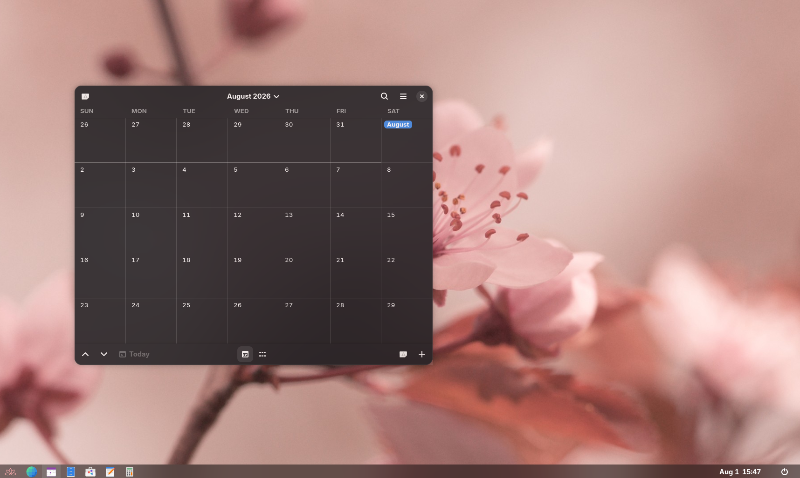
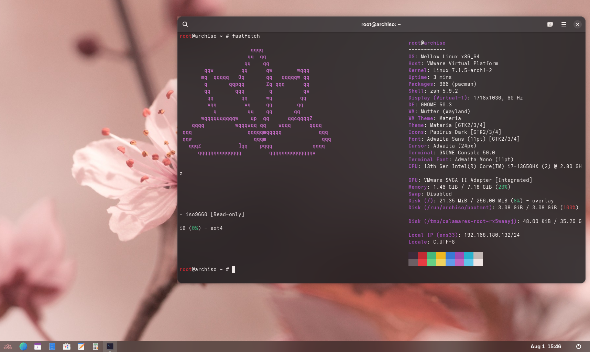

<div align="center">


**A modern, Arch-based Linux distribution focused on simplicity, elegance, and customizability**


</div>

---

## About

Mellow Linux is an Arch-based Linux distribution designed to provide a clean, modern, and enjoyable desktop experience without getting in your way. It combines the flexibility and rolling-release nature of Arch Linux with a polished, user-friendly environment, making it suitable for both newcomers and experienced Linux users.

Rather than changing what makes Arch great, Mellow builds upon it by offering sensible defaults, a refined visual style, and a foundation that's easy to personalize. Whether you're using your computer for development, gaming, content creation, or everyday tasks, Mellow aims to stay fast, reliable, and out of your way.


---

> **Mellow Linux is currently in active development. Features, appearance, and documentation are subject to change as the project evolves.**
 






## How to Build

Mellow Linux uses `mkarchiso` to build the installation image.

### Requirements

Install the required packages:

```bash
sudo pacman -S archiso git
```

### Clone the Repository

```bash
git clone https://github.com/f1ow3rss/mellow-linux.git
cd mellow-linux
```

### Build the ISO

```bash
sudo mkarchiso -v -w work -o out .
```

The finished ISO will be located in the `out/` directory.

### Test the ISO (recommended)

You can test the generated image in a virtual machine using software such as VMware, VirtualBox, or QEMU before installing it on real hardware.

---